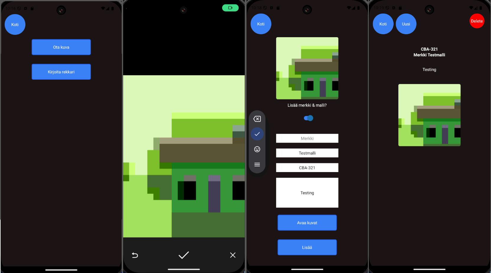
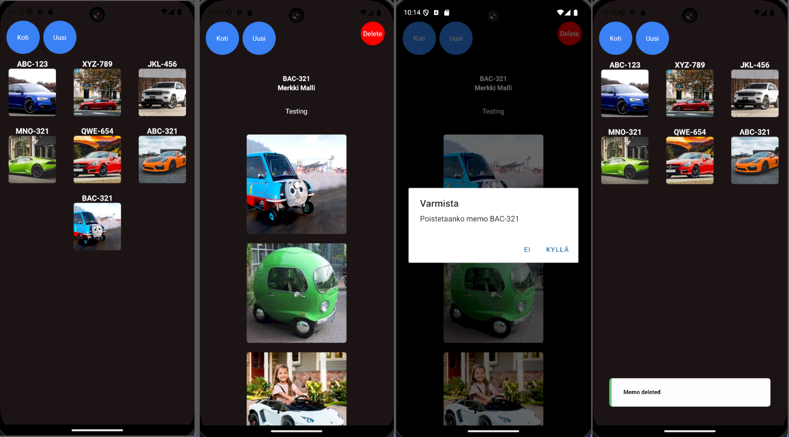

Pieni muistiinpano app, jolla voitaisiin eristää autoihin liittyvät muistiinpanot omaan appiinsa. React-native-app oli jälkiajatus, jonka voisi kehittää toimimaan webbisivun kanssa, jolloin muistiinpanot tehtäisiin puhelimella, ja niitä voisi tarkastella webbisivuilla. Toinen ratkaisu olisi muuttaa react-native-app muistiinpano tallennus lokaaliksi puhelimelle, ja niin oliskin tehnyt jos tekisin projektin uudestaan. En halunnut kuitenkaan lisätä Databasea backendiin, koska projekti olisi pitänyt alunperinkin tehdä suoraan react-nativella käyttämään puhelimen muistia.

Apilla memon tekeminen

Apilla memon poisto

